**日本語** | [English](README_EN.md) | [繁體中文](README_ZH.md)

<h1>Chat Overlay</h1>

Android向けの透明なYouTube/Twitchチャットオーバーレイ、ライブ配信で使用するもの。
  

---

## 機能

- ✔️ Twitch、YouTubeのチャットルームを表示。
- ✔️ Text-to-Speechによるチャットメッセージの読み上げ。
- ✔️ 3つの言語から選択可能：繁体字中国語、英語、日本語。
- ✔️ 文字サイズ、行間、ユーザー名、絵文字のサイズを個別に調整可能。
- ✔️ 透明なチャットウィンドウは自由に移動・サイズ変更可能。
- ✔️ UIは3秒後に自動的に非表示になり、コメント部分のみが表示されます。コメントの左半分をタップするとUIが再表示されます。
- ✔️ Twitch 視聴者数・配信時間表示。
- ✔️ Twitch チャンネルアナウンス、視聴ストリーク、サブスク、レイド、その他の特殊メッセージの表示。
- ✔️ YouTube の Super Chat、Super Sticker、メンバーシップ加入の通知表示を追加。
- ✔️ YouTube の視聴者数表示。
  
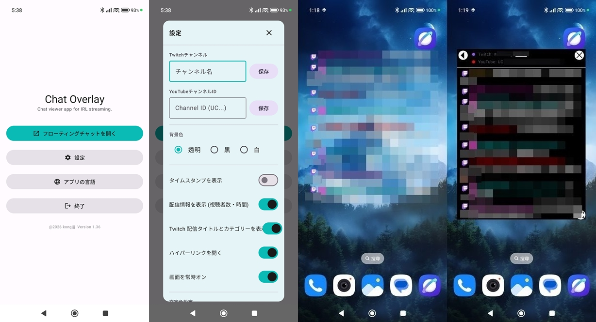

---

## 使用方法
- UIインターフェースのボタン説明。
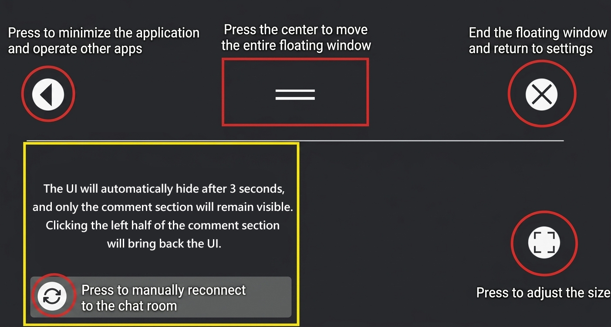
- 他の配信ソフトと連携して使用する際の画面。UIが表示されている状態。
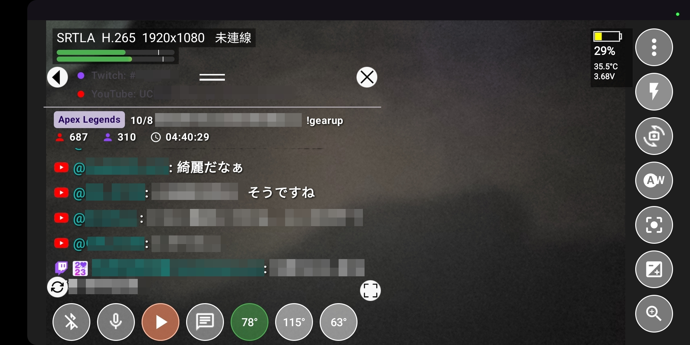
- UI非表示後。
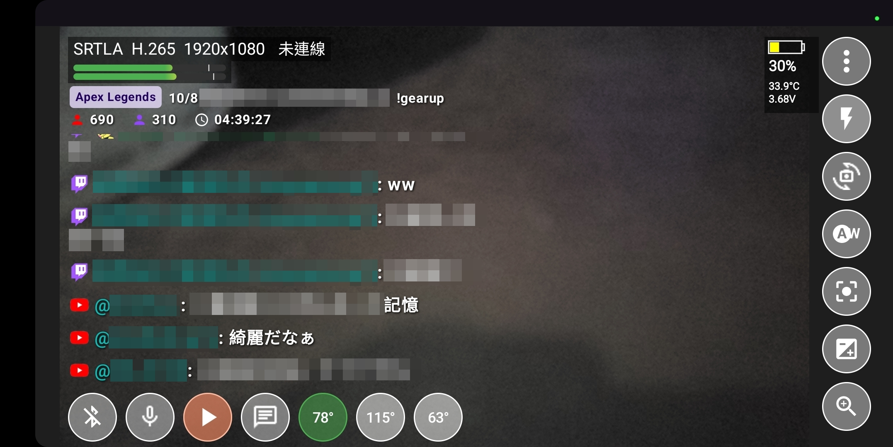
- その他のスクリーンショット
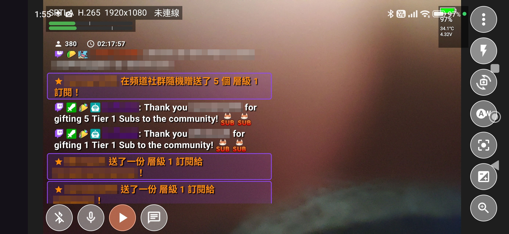
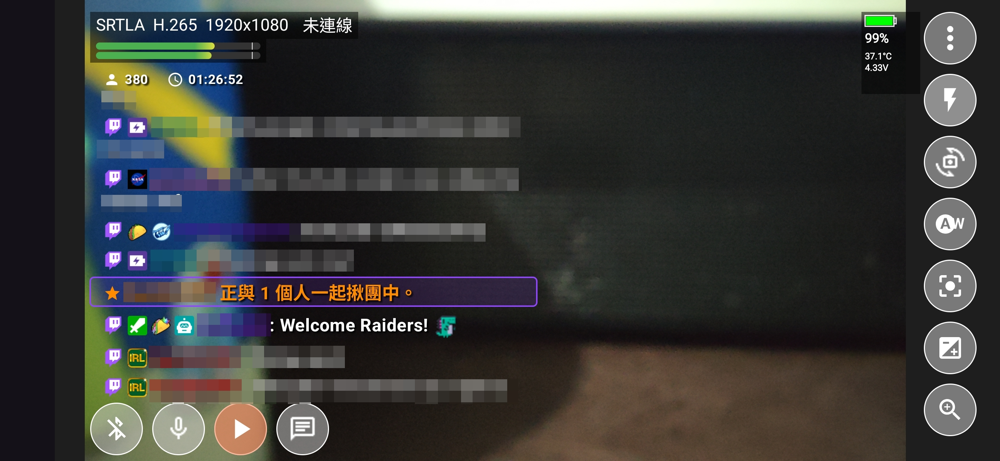  
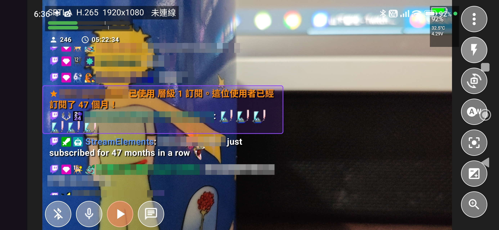
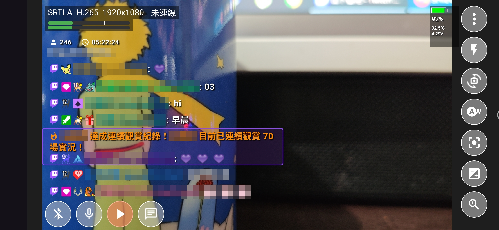
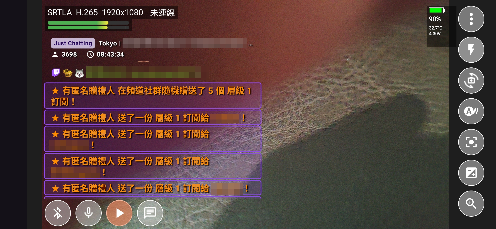
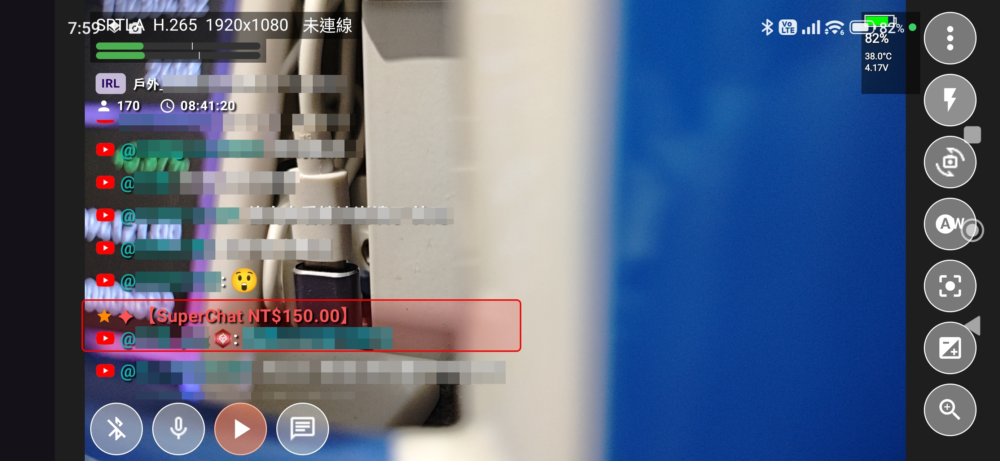
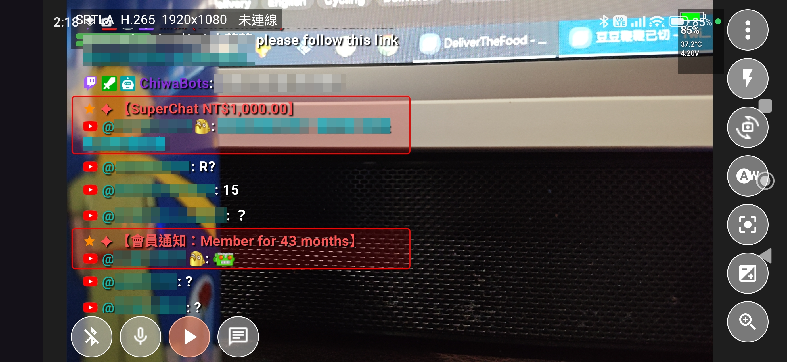 
---

## インストール方法
[GitHub releases](https://github.com/masarujp2022/Chat-Overlay/releases) にて最新の .apk ファイルを公開します。

スマートフォンで GitHub のリリースページを開き、.apk ファイルをダウンロードしてインストールしてください。

---

## その他の制作アプリ

