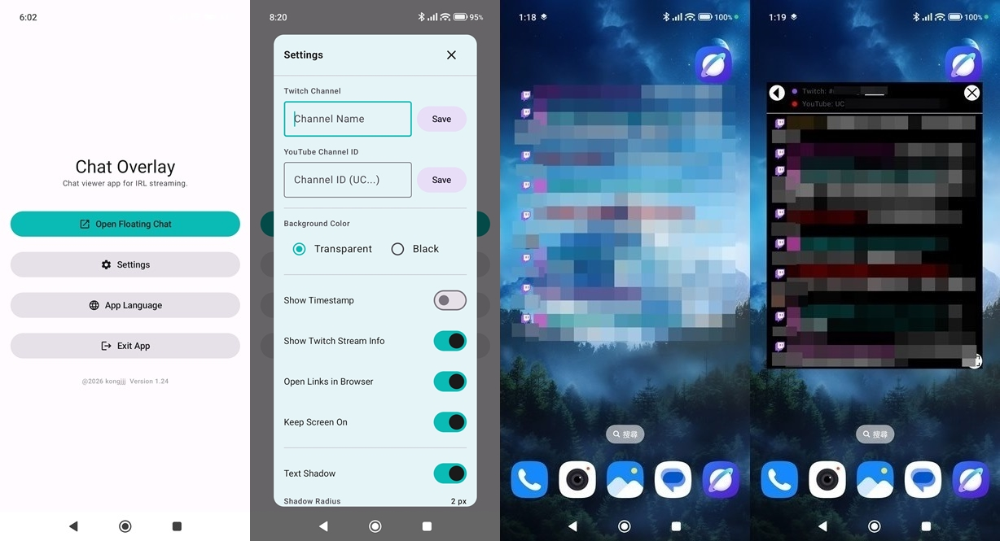
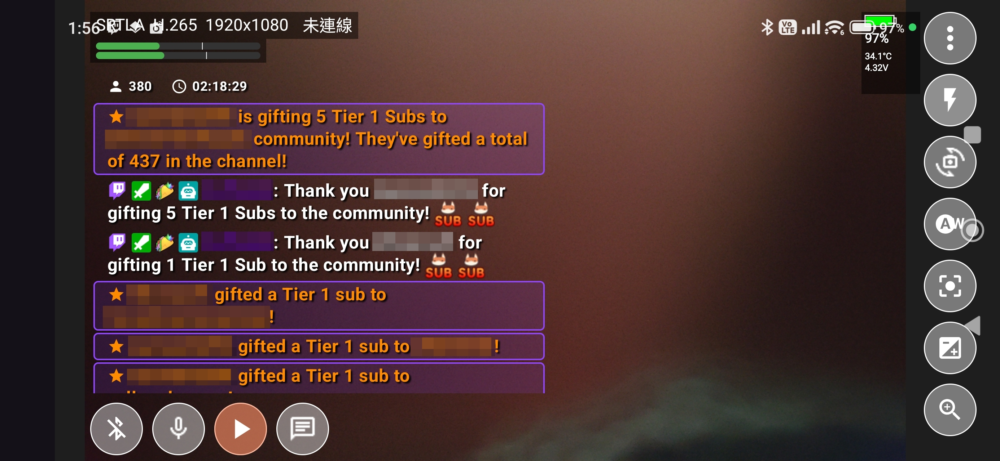
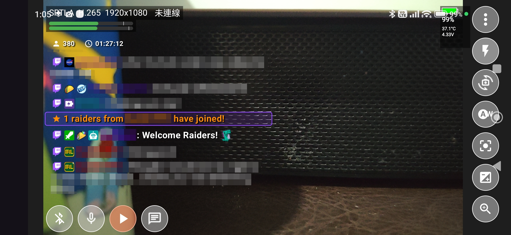
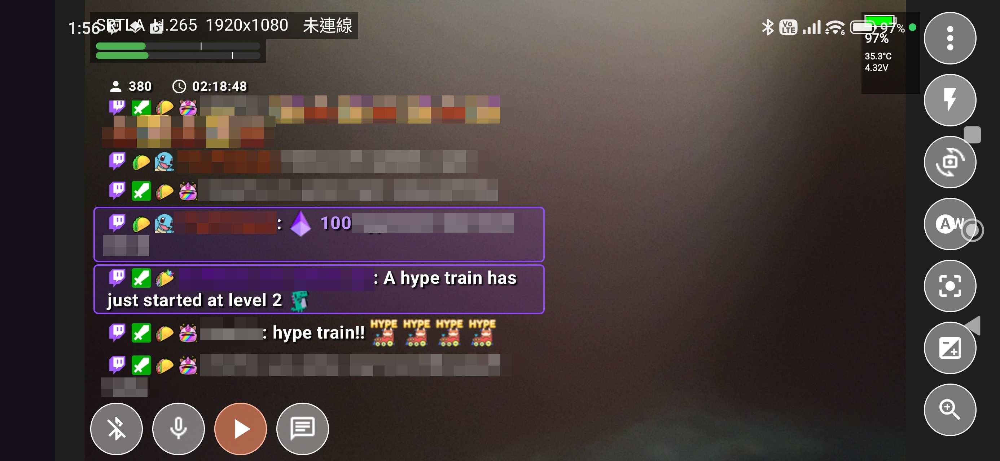

**English** | [繁體中文](README_ZH.md) | [日本語](README.md) 

<h1>Chat Overlay</h1>

An Android Transparent Youtube/Twitch Chat viewer app for IRL streaming.
  

---

## Features

- ✔️ Display in Twitch and YouTube chatrooms.
- ✔️ Text-to-Speech reading of chat messages, Chat hyperlinks can be clicked to pop up a browser.
- ✔️ 3 language options: Traditional Chinese, English, and Japanese.
- ✔️ Font size, shadow, line spacing, usernames, and emoji size can be adjusted individually.
- ✔️ The transparent chat box can be freely moved and resized.
- ✔️ The UI will automatically hide after 3 seconds, and only the comment section will remain visible. Clicking the left half of the comment section will bring back the UI.
- ✔️ Twitch Stream info (Viewer Count & Stream Duration, Stream Category and Stream Title) Display.
- ✔️ Display support for Twitch channel announcements, watch streaks, subscriptions, raids, and other special messages.

---

## Usage

- The screen view when used with live streaming software.Before UI Disappears.

- After UI Disappears.

- Other Screenshots

  
---

## Installation Method
I will publish the latest .apk file in the [GitHub releases](https://github.com/masarujp2022/Chat-Overlay/releases) 

You can open the GitHub releases page on your phone, download the .apk file, and install it.

---

## Other projects I have made
- [Live Streaming Camera](https://github.com/kongjjj/Live-Streaming-Camera)：An Android live streaming app built using Chinese language.

